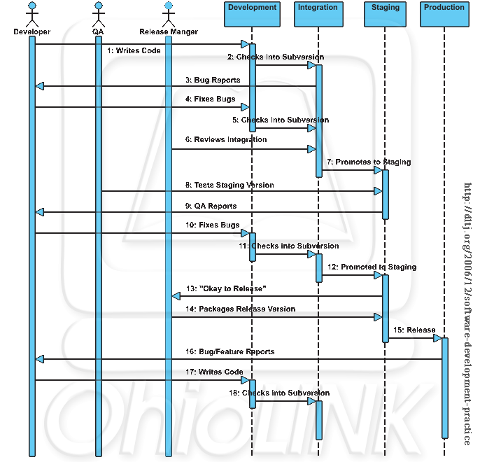

## Topics

- Version Control (`git`)
- Advanced Python
- Production Python

## Version Control

* Why use version control tools?
* `git` vs. GitHub
* [Sourcetree](https://www.sourcetreeapp.com/)
* `git` on white board (distributed version control flow)
* basic `git` commands:
	* `git init` and `git clone`
	* `git status`, `git add` and `git commit`
	* `git push`
	* `git pull`
	* `git checkout` and `git branch`
	* `git merge` and resolve conflicts
	* `git rebase`
	* `git stash`
* Github specials
	* fork
	* pull requests

## Advanced Python

### Setup

0. Pro tip: use Python3

#### Anaconda
Anaconda is very good Python package manager + environment manager + additional scientific libraries. Highly recommend for local development. Not recommend for servers, as its ~3GB.
1. Download and install Anaconda Python 3.6 [here](https://www.anaconda.com/download/#macos)
2. Create environment `conda create --name test --file conda-requirements.txt`
3. `source activate test` (vs. `source deactivate`)
4. `whichp python`

Note that the `test` environment folder is usually stored with your `anaconda`. To check, try `which conda`.  

#### `pip` + `virtualenv`
`pip` is light-weigt Python pacakge manager. `virtualenv` is light-weight Python environment manager.

1. Install [Python3](http://docs.python-guide.org/en/latest/starting/install3/osx/)
2. Go to the folder where you want to install your env, usually the repo.
3. Setup environment `virtualenv env -p python3` 
4. `source env/bin/activate` (vs. `deactivate`)
5. `pip install -r requirements.txt`
6. `which python`

### Fluent Python

Please refer to `src/fluent_python/*.py` for the code.

* List Comprehension 
* Generator, `yield`, `yield from`
* Decorator
* Functional programming
* Variable Scope
* Operator overloading
* Interface and `abc`
* Inheritance vs. Composition (no `.py`, draw on board and look at [Sklearn](https://github.com/scikit-learn/scikit-learn/blob/69e10b53a632ceac768513e8bf0ff8ff83d6e7fc/sklearn/discriminant_analysis.py#L130))
* Python function call-by

## Production Python

### Development Environment

* **Local/Development**: your laptop or a sandbox on a development server 
* **Testing**: for all the tests, shares the same environement as `staging` and `production`
* **Staging**: an environment for final testing immediately prior to deploying to production. A mirror of `production`, but not facing to the users.
* **Production**: the environment that users/clients directly interact with

### Python Debug

* Why bother debugging? 
* You need to debug when:
	- you see a Shape ratio of 40
	- you are trying to understand your teammate's code
* How many of you debug via:
	- `print(...)`
	- Binary search
	- `pdb`/`ipdb`
* Examples 
	- debug in `ipdb` (make sure you `pip install ipdb`)
	- debug in `ipython notebook` (use the magic command `%debug` after you see an error)

### Python Tests

* Why bother testings?
	- Collborations
	- Too big to fail
	- Know who to blame
* Different types of tests
	- lint checks
	- unit test
	- integration test
	- regression test
	- ...

#### Lint

* Why we need [Lint](https://blog.sideci.com/about-style-guide-of-python-and-linter-tool-pep8-pyflakes-flake8-haking-pyling-7fdbe163079d)?
* `flake8`: try `flake8 src/production_code`
* `pylint`: try `pylint src/production_code`
* `mypy`: type hint (only), try `mypy src/mypy_examples`

#### Unit Test

* Why do we need unit tests?
* try: `pytest src/production_code`

#### Continuous Integration

Continuous Integration (CI) tools help you stick to your team’s quality standards by running tests every time you push a new commit and reporting the results to a pull request.

Examples:
- [Travis CI](https://github.com/marketplace/travis-ci)
- [Jenkins](https://jenkins.io/)

### makefile

* Make your life easier
* `make lint` instead of running `flake8` + `pylint` + `mypy`
* `make install` <- who doesn't like 1-click setup?
* checkout `Makefile`

### docker (very brief, no code)
* ref: [A Beginner-Friendly Introduction to Containers, VMs and Docker](https://medium.freecodecamp.org/a-beginner-friendly-introduction-to-containers-vms-and-docker-79a9e3e119b)
